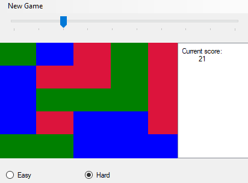

https://ci.appveyor.com/api/projects/status/gp7wo49in4tbfkuq?svg=true

## :video_game: SameGame

SameGame is also known as Clickomania or Chain Shot! It's a tile matching puzzle containing of a number of coloured blocks. The goal is to remove as many blocks as possible. Blocks can be removed when at least two of the same colors are next to each other.

The easy version of the game lets you collect each block at a time, the hard one is the proper game implementation. The game is available in different sizes:
* 5x5
* 5x10
* 10x5
* 10x10

## :link: Useful links
:video_game: [SameGame on Wikipedia](https://en.wikipedia.org/wiki/SameGame)